# Mappa architetturale esplorativa

Generata dal dataset `graph.json`. Metodo manuale/testuale; nessun arco RESOLVED.

```mermaid
flowchart LR
  app["FusionTakeoffApp"]
  content["ContentView"]
  inspector["InspectorView"]
  viewport["ViewportView"]
  model["DesignModel"]
  document["CADCore.CADDocument"]
  feature["CADCore.Feature"]
  kind["Feature.Kind"]
  profile["Profile2D"]
  primitives["Primitives"]
  operations["Operations"]
  mesh["Mesh"]
  vec3["Vec3"]
  vec2["Vec2"]
  stl["STLExporter"]
  validator["MeshValidator"]
  filesystem["File system · .ftk / .stl"]
  scenekit["SceneKit · GPU"]
  swiftui["SwiftUI lifecycle"]
  representable["NSViewRepresentable"]
  codable["Codable"]
  app -->|"owns_observable_state · SYNTACTIC"| model
  app -->|"constructs_type · SYNTACTIC"| content
  app -->|"injects_environment_object · SYNTACTIC"| content
  content -->|"observes_object · SYNTACTIC"| model
  inspector -->|"observes_object · SYNTACTIC"| model
  content -->|"constructs_type · SYNTACTIC"| viewport
  content -->|"constructs_type · SYNTACTIC"| inspector
  inspector -->|"binds_state · SYNTACTIC"| model
  model -->|"owns_state · SYNTACTIC"| document
  model -->|"constructs_type · SYNTACTIC"| feature
  model -->|"calls_direct · SYNTACTIC"| document
  model -->|"calls_direct · SYNTACTIC"| stl
  model -->|"calls_direct · SYNTACTIC"| validator
  model -->|"persists_model · RUNTIME/EXTERNAL"| filesystem
  model -->|"loads_resource · RUNTIME/EXTERNAL"| filesystem
  model -->|"writes_export · RUNTIME/EXTERNAL"| filesystem
  document -->|"references_symbol · SYNTACTIC"| feature
  feature -->|"owns_state · SYNTACTIC"| kind
  feature -->|"calls_direct · SYNTACTIC"| primitives
  feature -->|"calls_direct · SYNTACTIC"| operations
  feature -->|"calls_direct · SYNTACTIC"| mesh
  document -->|"calls_direct · SYNTACTIC"| mesh
  primitives -->|"calls_direct · SYNTACTIC"| operations
  primitives -->|"references_symbol · INFERRED"| profile
  operations -->|"calls_direct · SYNTACTIC"| profile
  operations -->|"constructs_type · SYNTACTIC"| mesh
  mesh -->|"references_symbol · SYNTACTIC"| vec3
  profile -->|"references_symbol · SYNTACTIC"| vec2
  stl -->|"calls_direct · SYNTACTIC"| mesh
  validator -->|"reads_state · SYNTACTIC"| mesh
  viewport -->|"calls_direct · SYNTACTIC"| feature
  viewport -->|"bridges_to_objc · RUNTIME/EXTERNAL"| scenekit
  swiftui -->|"runtime_callback · RUNTIME/EXTERNAL"| viewport
  viewport -->|"type_conforms_protocol · SYNTACTIC"| representable
  document -->|"type_conforms_protocol · SYNTACTIC"| codable
  profile -->|"type_conforms_protocol · SYNTACTIC"| codable
  feature -->|"type_conforms_protocol · SYNTACTIC"| codable
```

## Evidenze

| Arco | Relazione | Stato | File e riga |
|---|---|---|---|
| app → model | owns_observable_state | SYNTACTIC | `App/Sources/UI/FusionTakeoffApp.swift:5` |
| app → content | constructs_type | SYNTACTIC | `App/Sources/UI/FusionTakeoffApp.swift:9` |
| app → content | injects_environment_object | SYNTACTIC | `App/Sources/UI/FusionTakeoffApp.swift:10` |
| content → model | observes_object | SYNTACTIC | `App/Sources/UI/Workspace/ContentView.swift:5` |
| inspector → model | observes_object | SYNTACTIC | `App/Sources/UI/Workspace/ContentView.swift:60` |
| content → viewport | constructs_type | SYNTACTIC | `App/Sources/UI/Workspace/ContentView.swift:22` |
| content → inspector | constructs_type | SYNTACTIC | `App/Sources/UI/Workspace/ContentView.swift:35` |
| inspector → model | binds_state | SYNTACTIC | `App/Sources/UI/Workspace/ContentView.swift:63` |
| model → document | owns_state | SYNTACTIC | `App/Sources/Model/DesignModel.swift:10` |
| model → feature | constructs_type | SYNTACTIC | `App/Sources/Model/DesignModel.swift:20` |
| model → document | calls_direct | SYNTACTIC | `App/Sources/Model/DesignModel.swift:71` |
| model → stl | calls_direct | SYNTACTIC | `App/Sources/Model/DesignModel.swift:78` |
| model → validator | calls_direct | SYNTACTIC | `App/Sources/Model/DesignModel.swift:79` |
| model → filesystem | persists_model | RUNTIME/EXTERNAL | `App/Sources/Model/DesignModel.swift:54` |
| model → filesystem | loads_resource | RUNTIME/EXTERNAL | `App/Sources/Model/DesignModel.swift:64` |
| model → filesystem | writes_export | RUNTIME/EXTERNAL | `App/Sources/Model/DesignModel.swift:78` |
| document → feature | references_symbol | SYNTACTIC | `Packages/CADCore/Sources/CADCore/Document.swift:37` |
| feature → kind | owns_state | SYNTACTIC | `Packages/CADCore/Sources/CADCore/Document.swift:13` |
| feature → primitives | calls_direct | SYNTACTIC | `Packages/CADCore/Sources/CADCore/Document.swift:24` |
| feature → operations | calls_direct | SYNTACTIC | `Packages/CADCore/Sources/CADCore/Document.swift:26` |
| feature → mesh | calls_direct | SYNTACTIC | `Packages/CADCore/Sources/CADCore/Document.swift:28` |
| document → mesh | calls_direct | SYNTACTIC | `Packages/CADCore/Sources/CADCore/Document.swift:43` |
| primitives → operations | calls_direct | SYNTACTIC | `Packages/CADCore/Sources/CADCore/Operations.swift:28` |
| primitives → profile | references_symbol | INFERRED | `Packages/CADCore/Sources/CADCore/Operations.swift:32` |
| operations → profile | calls_direct | SYNTACTIC | `Packages/CADCore/Sources/CADCore/Operations.swift:12` |
| operations → mesh | constructs_type | SYNTACTIC | `Packages/CADCore/Sources/CADCore/Operations.swift:9` |
| mesh → vec3 | references_symbol | SYNTACTIC | `Packages/CADCore/Sources/CADCore/Mesh.swift:6` |
| profile → vec2 | references_symbol | SYNTACTIC | `Packages/CADCore/Sources/CADCore/Sketch.swift:5` |
| stl → mesh | calls_direct | SYNTACTIC | `Packages/CADCore/Sources/CADCore/Export.swift:13` |
| validator → mesh | reads_state | SYNTACTIC | `Packages/CADCore/Sources/CADCore/Export.swift:77` |
| viewport → feature | calls_direct | SYNTACTIC | `App/Sources/UI/Viewport/ViewportView.swift:26` |
| viewport → scenekit | bridges_to_objc | RUNTIME/EXTERNAL | `App/Sources/UI/Viewport/ViewportView.swift:97` |
| swiftui → viewport | runtime_callback | RUNTIME/EXTERNAL | `App/Sources/UI/Viewport/ViewportView.swift:22` |
| viewport → representable | type_conforms_protocol | SYNTACTIC | `App/Sources/UI/Viewport/ViewportView.swift:6` |
| document → codable | type_conforms_protocol | SYNTACTIC | `Packages/CADCore/Sources/CADCore/Document.swift:33` |
| profile → codable | type_conforms_protocol | SYNTACTIC | `Packages/CADCore/Sources/CADCore/Sketch.swift:4` |
| feature → codable | type_conforms_protocol | SYNTACTIC | `Packages/CADCore/Sources/CADCore/Document.swift:4` |
