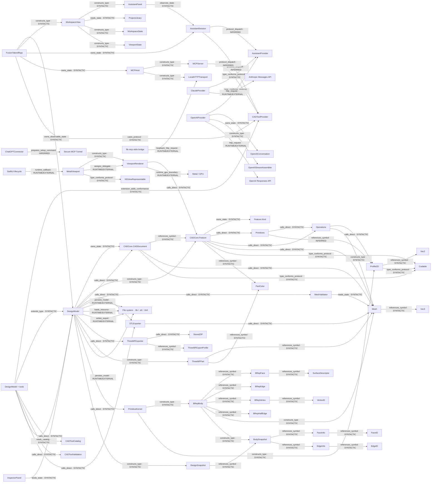

# Mappa architetturale esplorativa

Generata dal dataset `graph.json`. Metodo manuale/testuale; nessun arco RESOLVED.

## Evidenze

| Arco | Relazione | Stato | File e riga |
|---|---|---|---|
| app → model | owns_observable_state | SYNTACTIC | `App/Sources/UI/FusionTakeoffApp.swift:5` |
| model → document | owns_state | SYNTACTIC | `App/Sources/Model/DesignModel.swift:21` |
| model → feature | constructs_type | SYNTACTIC | `App/Sources/Model/DesignModel.swift:66` |
| model → document | calls_direct | SYNTACTIC | `App/Sources/Model/DesignModel.swift:142` |
| model → stl | calls_direct | SYNTACTIC | `App/Sources/Model/DesignModel.swift:149` |
| model → validator | calls_direct | SYNTACTIC | `App/Sources/Model/DesignModel.swift:150` |
| model → filesystem | persists_model | RUNTIME/EXTERNAL | `App/Sources/Model/DesignModel.swift:124` |
| model → filesystem | loads_resource | RUNTIME/EXTERNAL | `App/Sources/Model/DesignModel.swift:134` |
| model → filesystem | writes_export | RUNTIME/EXTERNAL | `App/Sources/Model/DesignModel.swift:149` |
| document → feature | references_symbol | SYNTACTIC | `Packages/CADCore/Sources/CADCore/Document.swift:52` |
| feature → kind | owns_state | SYNTACTIC | `Packages/CADCore/Sources/CADCore/Document.swift:13` |
| feature → primitives | calls_direct | SYNTACTIC | `Packages/CADCore/Sources/CADCore/Document.swift:39` |
| feature → operations | calls_direct | SYNTACTIC | `Packages/CADCore/Sources/CADCore/Document.swift:41` |
| feature → mesh | calls_direct | SYNTACTIC | `Packages/CADCore/Sources/CADCore/Document.swift:43` |
| document → mesh | calls_direct | SYNTACTIC | `Packages/CADCore/Sources/CADCore/Document.swift:58` |
| primitives → operations | calls_direct | SYNTACTIC | `Packages/CADCore/Sources/CADCore/Operations.swift:28` |
| primitives → profile | references_symbol | INFERRED | `Packages/CADCore/Sources/CADCore/Operations.swift:32` |
| operations → profile | calls_direct | SYNTACTIC | `Packages/CADCore/Sources/CADCore/Operations.swift:12` |
| operations → mesh | constructs_type | SYNTACTIC | `Packages/CADCore/Sources/CADCore/Operations.swift:9` |
| mesh → vec3 | references_symbol | SYNTACTIC | `Packages/CADCore/Sources/CADCore/Mesh.swift:6` |
| profile → vec2 | references_symbol | SYNTACTIC | `Packages/CADCore/Sources/CADCore/Sketch.swift:5` |
| stl → mesh | calls_direct | SYNTACTIC | `Packages/CADCore/Sources/CADCore/Export.swift:13` |
| validator → mesh | reads_state | SYNTACTIC | `Packages/CADCore/Sources/CADCore/Export.swift:77` |
| document → codable | type_conforms_protocol | SYNTACTIC | `Packages/CADCore/Sources/CADCore/Document.swift:48` |
| profile → codable | type_conforms_protocol | SYNTACTIC | `Packages/CADCore/Sources/CADCore/Sketch.swift:4` |
| feature → codable | type_conforms_protocol | SYNTACTIC | `Packages/CADCore/Sources/CADCore/Document.swift:4` |
| app → content | constructs_type | SYNTACTIC | `App/Sources/UI/FusionTakeoffApp.swift:12` |
| app → chat | owns_state | SYNTACTIC | `App/Sources/UI/FusionTakeoffApp.swift:8` |
| app → mcphost | owns_state | SYNTACTIC | `App/Sources/UI/FusionTakeoffApp.swift:6` |
| app → toolprotocol | casts_protocol | SYNTACTIC | `App/Sources/UI/FusionTakeoffApp.swift:21` |
| content → chatui | constructs_type | SYNTACTIC | `App/Sources/UI/Workspace/WorkspaceView.swift:67` |
| inspector → model | binds_state | SYNTACTIC | `App/Sources/UI/Workspace/InspectorPanel.swift:21` |
| chatui → chat | observes_state | SYNTACTIC | `App/Sources/UI/Assistant/AssistantPanel.swift:6` |
| chat → assistantprotocol | protocol_dispatch | INFERRED | `App/Sources/Integration/Assistant/AssistantSession.swift:99` |
| chat → toolprotocol | protocol_dispatch | INFERRED | `App/Sources/Integration/Assistant/AssistantSession.swift:174` |
| claude → assistantprotocol | type_conforms_protocol | SYNTACTIC | `App/Sources/Integration/Assistant/ClaudeProvider.swift:9` |
| openai → assistantprotocol | type_conforms_protocol | SYNTACTIC | `App/Sources/Integration/OpenAI/OpenAIProvider.swift:7` |
| openai → openaihistory | owns_state | SYNTACTIC | `App/Sources/Integration/OpenAI/OpenAIProvider.swift:19` |
| openai → openaistream | constructs_type | SYNTACTIC | `App/Sources/Integration/OpenAI/OpenAIProvider.swift:67` |
| openai → openaiapi | http_request | RUNTIME/EXTERNAL | `App/Sources/Integration/OpenAI/OpenAIProvider.swift:47` |
| claude → anthropicapi | http_request | RUNTIME/EXTERNAL | `App/Sources/Integration/Assistant/ClaudeProvider.swift:72` |
| chatgpt → tunnel | prepares_setup_command | INFERRED | `App/Sources/Integration/ChatGPT/ChatGPTConnector.swift:18` |
| mcphost → mcpserver | constructs_type | SYNTACTIC | `App/Sources/Integration/MCP/MCPHost.swift:28` |
| mcphost → http | constructs_type | SYNTACTIC | `App/Sources/Integration/MCP/MCPHost.swift:60` |
| mcpserver → toolprotocol | protocol_dispatch | INFERRED | `App/Sources/Integration/MCP/MCPServer.swift:82` |
| bridge → http | loopback_http_request | RUNTIME/EXTERNAL | `Tools/ftk-mcp/main.swift:80` |
| toolmodel → toolprotocol | extension_adds_conformance | SYNTACTIC | `App/Sources/Model/Tools/DesignModel+Tools.swift:17` |
| toolmodel → model | extends_type | SYNTACTIC | `App/Sources/Model/Tools/DesignModel+Tools.swift:17` |
| toolmodel → toolcatalog | reads_catalog | SYNTACTIC | `App/Sources/Model/Tools/DesignModel+Tools.swift:18` |
| toolmodel → toolvalidation | calls_direct | SYNTACTIC | `App/Sources/Model/Tools/DesignModel+Tools.swift:69` |
| toolmodel → stl | calls_direct | SYNTACTIC | `App/Sources/Model/Tools/DesignModel+Tools.swift:152` |
| viewport → renderer | constructs_type | SYNTACTIC | `App/Sources/UI/Viewport/MetalViewport.swift:33` |
| viewport → renderer | assigns_delegate | RUNTIME/EXTERNAL | `App/Sources/UI/Viewport/MetalViewport.swift:35` |
| renderer → feature | calls_direct | SYNTACTIC | `App/Sources/UI/Viewport/ViewportRenderer.swift:140` |
| renderer → metal | runtime_gpu_boundary | RUNTIME/EXTERNAL | `App/Sources/UI/Viewport/ViewportRenderer.swift:8` |
| swiftui → viewport | runtime_callback | RUNTIME/EXTERNAL | `App/Sources/UI/Viewport/MetalViewport.swift:41` |
| viewport → representable | type_conforms_protocol | SYNTACTIC | `App/Sources/UI/Viewport/MetalViewport.swift:7` |
| feature → partcolor | references_symbol | SYNTACTIC | `Packages/CADCore/Sources/CADCore/Document.swift:16` |
| model → threeMF | calls_direct | SYNTACTIC | `App/Sources/Model/DesignModel.swift:169` |
| model → threeMFpart | constructs_type | SYNTACTIC | `App/Sources/Model/DesignModel.swift:167` |
| threeMFpart → mesh | references_symbol | SYNTACTIC | `Packages/CADCore/Sources/CADCore/ThreeMFExporter.swift:7` |
| threeMFpart → partcolor | references_symbol | SYNTACTIC | `Packages/CADCore/Sources/CADCore/ThreeMFExporter.swift:8` |
| threeMF → zip | calls_direct | SYNTACTIC | `Packages/CADCore/Sources/CADCore/ThreeMFExporter.swift:101` |
| threeMF → threeMFprofile | references_symbol | SYNTACTIC | `Packages/CADCore/Sources/CADCore/ThreeMFExporter.swift:30` |
| toolmodel → model | calls_direct | SYNTACTIC | `App/Sources/Model/Tools/DesignModel+Tools.swift:172` |
| model → filesystem | persists_model | RUNTIME/EXTERNAL | `App/Sources/Model/DesignModel.swift:179` |
| model → kernel | calls_direct | SYNTACTIC | `App/Sources/Model/DesignModel.swift:54` |
| model → designsnapshot | constructs_type | SYNTACTIC | `App/Sources/Model/DesignModel.swift:59` |
| designsnapshot → bodysnapshot | references_symbol | SYNTACTIC | `App/Sources/Model/DesignModel.swift:13` |
| kernel → brepbody | constructs_type | SYNTACTIC | `Packages/CADCore/Sources/CADCore/Kernel/PrimitiveKernel.swift:122` |
| kernel → profile | constructs_type | SYNTACTIC | `Packages/CADCore/Sources/CADCore/Kernel/PrimitiveKernel.swift:40` |
| brepbody → brepface | references_symbol | SYNTACTIC | `Packages/CADCore/Sources/CADCore/Kernel/Topology.swift:80` |
| brepbody → brepedge | references_symbol | SYNTACTIC | `Packages/CADCore/Sources/CADCore/Kernel/Topology.swift:78` |
| brepbody → brepvertex | references_symbol | SYNTACTIC | `Packages/CADCore/Sources/CADCore/Kernel/Topology.swift:77` |
| brepbody → brephalfedge | references_symbol | SYNTACTIC | `Packages/CADCore/Sources/CADCore/Kernel/Topology.swift:79` |
| brepbody → mesh | constructs_type | SYNTACTIC | `Packages/CADCore/Sources/CADCore/Kernel/Topology.swift:86` |
| brepbody → bodysnapshot | constructs_type | SYNTACTIC | `Packages/CADCore/Sources/CADCore/Kernel/BodySnapshot.swift:101` |
| brepface → surface | references_symbol | SYNTACTIC | `Packages/CADCore/Sources/CADCore/Kernel/Topology.swift:70` |
| bodysnapshot → faceinfo | references_symbol | SYNTACTIC | `Packages/CADCore/Sources/CADCore/Kernel/BodySnapshot.swift:37` |
| bodysnapshot → edgeinfo | references_symbol | SYNTACTIC | `Packages/CADCore/Sources/CADCore/Kernel/BodySnapshot.swift:38` |
| faceinfo → faceid | references_symbol | SYNTACTIC | `Packages/CADCore/Sources/CADCore/Kernel/BodySnapshot.swift:4` |
| edgeinfo → edgeid | references_symbol | SYNTACTIC | `Packages/CADCore/Sources/CADCore/Kernel/BodySnapshot.swift:12` |
| brepvertex → vertexid | references_symbol | SYNTACTIC | `Packages/CADCore/Sources/CADCore/Kernel/Topology.swift:40` |
| content → projectlibrary | reads_state | SYNTACTIC | `App/Sources/UI/Workspace/WorkspaceView.swift:8` |
| content → workspacestate | constructs_type | SYNTACTIC | `App/Sources/UI/Workspace/WorkspaceView.swift:9` |
| content → viewportstate | constructs_type | SYNTACTIC | `App/Sources/UI/Workspace/WorkspaceView.swift:10` |
