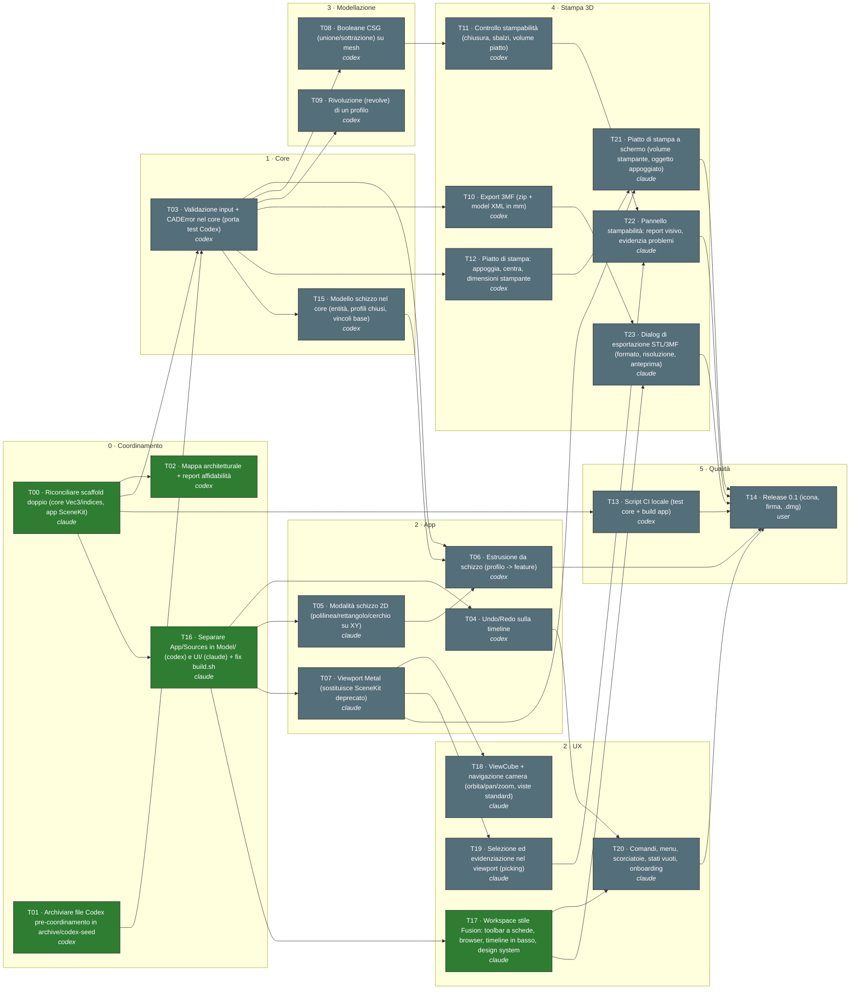

# Grafo dei task

_Generato da `scripts/graph.py` — 2026-09-25 09:45. Non modificare a mano._

Legenda: verde = done · giallo = in corso · rosso = bloccato · grigio = da fare. Etichetta: `ID · titolo · agente`.

## Pronti da iniziare

- **T03** Validazione input + CADError nel core (porta test Codex) — suggerito: codex
- **T04** Undo/Redo sulla timeline — suggerito: codex
- **T05** Modalità schizzo 2D (polilinea/rettangolo/cerchio su XY) — suggerito: claude
- **T07** Viewport Metal (sostituisce SceneKit deprecato) — suggerito: claude
- **T13** Script CI locale (test core + build app) — suggerito: codex

## Tabella

| ID | Titolo | Stato | Agente | Dipende da | File |
|---|---|---|---|---|---|
| T00 | Riconciliare scaffold doppio (core Vec3/indices, app SceneKit) | done | claude | — | Packages/CADCore App/Sources project.yml |
| T01 | Archiviare file Codex pre-coordinamento in archive/codex-seed | done | codex | — | archive/codex-seed App/TakeoffCADApp.swift App/CADDocument.swift App/EditorView.swift App/SketchView.swift App/MetalViewport.swift App/CADShaders.metal |
| T02 | Mappa architetturale + report affidabilità | done | codex | T00 | docs/architecture scripts/architecture_graph.py |
| T03 | Validazione input + CADError nel core (porta test Codex) | todo | codex | T00, T01 | Packages/CADCore/Sources/CADCore Packages/CADCore/Tests/CADCoreTests |
| T04 | Undo/Redo sulla timeline | todo | codex | T16 | App/Sources/Model |
| T05 | Modalità schizzo 2D (polilinea/rettangolo/cerchio su XY) | todo | claude | T16 | App/Sources/UI/Sketch |
| T06 | Estrusione da schizzo (profilo -> feature) | todo | codex | T05, T15, T03 | App/Sources/Model Packages/CADCore/Sources/CADCore/Document.swift |
| T07 | Viewport Metal (sostituisce SceneKit deprecato) | todo | claude | T16 | App/Sources/UI/Viewport |
| T08 | Booleane CSG (unione/sottrazione) su mesh | todo | codex | T03 | Packages/CADCore/Sources/CADCore/CSG.swift Packages/CADCore/Tests/CADCoreTests/CSGTests.swift |
| T09 | Rivoluzione (revolve) di un profilo | todo | codex | T03 | Packages/CADCore/Sources/CADCore/Revolve.swift Packages/CADCore/Tests/CADCoreTests/RevolveTests.swift |
| T10 | Export 3MF (zip + model XML in mm) | todo | codex | T03 | Packages/CADCore/Sources/CADCore/ThreeMF.swift Packages/CADCore/Tests/CADCoreTests/ThreeMFTests.swift |
| T11 | Controllo stampabilità (chiusura, sbalzi, volume piatto) | todo | codex | T08 | Packages/CADCore/Sources/CADCore/Printability.swift |
| T12 | Piatto di stampa: appoggia, centra, dimensioni stampante | todo | codex | T03 | Packages/CADCore/Sources/CADCore/Placement.swift Packages/CADCore/Tests/CADCoreTests/PlacementTests.swift |
| T13 | Script CI locale (test core + build app) | todo | codex | T00 | scripts/ci.sh |
| T14 | Release 0.1 (icona, firma, .dmg) | todo | user | T06, T20, T21, T22, T23, T13 | App/Resources project.yml |
| T15 | Modello schizzo nel core (entità, profili chiusi, vincoli base) | todo | codex | T03 | Packages/CADCore/Sources/CADCore/SketchModel.swift Packages/CADCore/Tests/CADCoreTests/SketchModelTests.swift |
| T16 | Separare App/Sources in Model/ (codex) e UI/ (claude) + fix build.sh | done | claude | T00 | App/Sources scripts/build.sh project.yml |
| T17 | Workspace stile Fusion: toolbar a schede, browser, timeline in basso, design system | done | claude | T16 | App/Sources/UI/Workspace App/Sources/UI/DesignSystem App/Sources/UI/FusionTakeoffApp.swift |
| T18 | ViewCube + navigazione camera (orbita/pan/zoom, viste standard) | todo | claude | T07 | App/Sources/UI/Viewport |
| T19 | Selezione ed evidenziazione nel viewport (picking) | todo | claude | T07 | App/Sources/UI/Viewport |
| T20 | Comandi, menu, scorciatoie, stati vuoti, onboarding | todo | claude | T17, T04 | App/Sources/UI/Commands App/Sources/UI/Onboarding |
| T21 | Piatto di stampa a schermo (volume stampante, oggetto appoggiato) | todo | claude | T07, T12 | App/Sources/UI/Viewport |
| T22 | Pannello stampabilità: report visivo, evidenzia problemi | todo | claude | T11, T19 | App/Sources/UI/Printability |
| T23 | Dialog di esportazione STL/3MF (formato, risoluzione, anteprima) | todo | claude | T10, T17 | App/Sources/UI/Export |
