# Grafo dei task

_Generato da `scripts/graph.py` — 2026-09-25 11:05. Non modificare a mano._

Legenda: verde = done · giallo = in corso · rosso = bloccato · grigio = da fare. Etichetta: `ID · titolo · agente`.

```mermaid
flowchart LR
  subgraph P0["0 · Coordinamento"]
    T00["T00 · Riconciliare scaffold doppio (core Vec3/indices, app SceneKit)<br/><i>claude</i>"]:::done
    T01["T01 · Archiviare file Codex pre-coordinamento in archive/codex-seed<br/><i>codex</i>"]:::done
    T02["T02 · Mappa architetturale + report affidabilità<br/><i>codex</i>"]:::done
    T16["T16 · Separare App/Sources in Model/ (codex) e UI/ (claude) + fix build.sh<br/><i>claude</i>"]:::done
  end
  subgraph P1["1 · Core"]
    T03["T03 · Validazione input + CADError nel core (porta test Codex)<br/><i>codex</i>"]:::todo
    T15["T15 · Modello schizzo nel core (entità, profili chiusi, vincoli base)<br/><i>codex</i>"]:::todo
  end
  subgraph P2["2 · App"]
    T04["T04 · Undo/Redo sulla timeline<br/><i>codex</i>"]:::todo
    T05["T05 · Modalità schizzo 2D (polilinea/rettangolo/cerchio su XY)<br/><i>claude</i>"]:::todo
    T06["T06 · Estrusione da schizzo (profilo -> feature)<br/><i>codex</i>"]:::todo
    T07["T07 · Viewport Metal (sostituisce SceneKit deprecato)<br/><i>claude</i>"]:::done
  end
  subgraph P3["3 · Modellazione"]
    T08["T08 · Booleane CSG (unione/sottrazione) su mesh<br/><i>codex</i>"]:::todo
    T09["T09 · Rivoluzione (revolve) di un profilo<br/><i>codex</i>"]:::todo
  end
  subgraph P4["4 · Stampa 3D"]
    T10["T10 · Export 3MF (zip + model XML in mm)<br/><i>codex</i>"]:::todo
    T11["T11 · Controllo stampabilità (chiusura, sbalzi, volume piatto)<br/><i>codex</i>"]:::todo
    T12["T12 · Piatto di stampa: appoggia, centra, dimensioni stampante<br/><i>codex</i>"]:::todo
    T21["T21 · Piatto di stampa a schermo (volume stampante, oggetto appoggiato)<br/><i>claude</i>"]:::todo
    T22["T22 · Pannello stampabilità: report visivo, evidenzia problemi<br/><i>claude</i>"]:::todo
    T23["T23 · Dialog di esportazione STL/3MF (formato, risoluzione, anteprima)<br/><i>claude</i>"]:::todo
  end
  subgraph P5["5 · Qualità"]
    T13["T13 · Script CI locale (test core + build app)<br/><i>codex</i>"]:::todo
    T14["T14 · Release 0.1 (icona, firma, .dmg)<br/><i>user</i>"]:::todo
  end
  subgraph P6["2 · UX"]
    T17["T17 · Workspace stile Fusion: toolbar a schede, browser, timeline in basso, design system<br/><i>claude</i>"]:::done
    T18["T18 · ViewCube + navigazione camera (orbita/pan/zoom, viste standard)<br/><i>claude</i>"]:::done
    T19["T19 · Selezione ed evidenziazione nel viewport (picking)<br/><i>claude</i>"]:::done
    T20["T20 · Comandi, menu, scorciatoie, stati vuoti, onboarding<br/><i>claude</i>"]:::todo
    T25["T25 · Pannello comando generico stile Fusion (OK/Annulla, anteprima, da ParameterSpec)<br/><i>claude</i>"]:::done
    T61["T61 · Schizzo v0: disegno XY (linea, rettangolo, cerchio, poligono) + Estrudi via add_extrude<br/><i>claude</i>"]:::done
  end
  subgraph P7["6 · CAD parametrico"]
    T24["T24 · Requisiti e architettura: lamiera completa, storico parametrico, parti e assiemi<br/><i>codex</i>"]:::done
  end
  subgraph P8["7 · Fondazioni CAD"]
    T26["T26 · Spike kernel B-rep macOS: OCCT, bridge Swift e prove topologiche<br/><i>codex</i>"]:::blocked
    T27["T27 · Documento v2: parti, occorrenze, ID stabili, parametri e migrazione<br/><i>codex</i>"]:::todo
    T30["T30 · Riferimenti topologici stabili e snapshot CAD per il renderer<br/><i>codex</i>"]:::todo
    T28["T28 · Motore feature parametrico: DAG, rebuild deterministico e diagnosi<br/><i>codex</i>"]:::todo
    T29["T29 · Storico persistente: edit session, rollback, soppressione e riordino<br/><i>codex</i>"]:::todo
  end
  subgraph P9["10 · UX CAD"]
    T40["T40 · UX parti e assiemi: browser gerarchico e componente attivo<br/><i>claude</i>"]:::todo
    T45["T45 · UX selezione CAD di facce-spigoli e riferimenti per istanza<br/><i>claude</i>"]:::todo
    T39["T39 · UX storico parametrico: marker, edit, riordino, stati e dipendenze<br/><i>claude</i>"]:::todo
    T41["T41 · UX giunti, DOF, movimento, interferenze e distinta<br/><i>claude</i>"]:::todo
    T42["T42 · UX ambiente lamiera: regole, flange e comandi avanzati<br/><i>claude</i>"]:::todo
    T43["T43 · UX Unfold-Refold e Flat Pattern con stato aggiornato-obsoleto<br/><i>claude</i>"]:::todo
    T44["T44 · UX documenti lamiera: tavole, note piega e dialog DXF-STEP<br/><i>claude</i>"]:::todo
  end
  subgraph P10["8 · Parti e assiemi"]
    T31["T31 · Modellazione parti B-rep: fori, raccordi, guscio, serie, sweep e loft<br/><i>codex</i>"]:::todo
    T32["T32 · Assiemi: occorrenze, trasformazioni, grounding, giunti e solver DOF<br/><i>codex</i>"]:::todo
    T33["T33 · Assiemi: moto, interferenze, distinta e riferimenti esterni revisionati<br/><i>codex</i>"]:::todo
  end
  subgraph P11["9 · Lamiera"]
    T34["T34 · Lamiera: regole versionate, base, flange, contorno, pieghe e rip<br/><i>codex</i>"]:::todo
    T35["T35 · Lamiera avanzata: hem, lofted, scarichi, chiusure, conversione e Join by Bend<br/><i>codex</i>"]:::todo
    T36["T36 · Lamiera: Unfold-Refold e lavorazioni attraverso le pieghe<br/><i>codex</i>"]:::todo
    T37["T37 · Lamiera: Flat Pattern versionato, DXF e dati tavole di piega<br/><i>codex</i>"]:::todo
  end
  subgraph P12["11 · Accettazione CAD"]
    T46["T46 · Verifica copertura completa lamiera e integrazione storico-parti-assiemi<br/><i>codex</i>"]:::todo
    T38["T38 · Prove end-to-end: salvataggio storico, assieme, lamiera e round-trip export<br/><i>codex</i>"]:::todo
  end
  subgraph P13["6 · Assistente e MCP"]
    T47["T47 · Integrazione: protocollo CADToolProvider/JSONValue + entitlements rete<br/><i>claude</i>"]:::done
    T48["T48 · Strumenti CAD v1 per assistente e MCP (CADToolProvider sul Model, undo per chiamata)<br/><i>codex</i>"]:::done
    T49["T49 · MCP core nell'app: JSON-RPC, tools/list-call, HTTP localhost + token, stato in UI<br/><i>claude</i>"]:::done
    T50["T50 · Connettore Claude: bridge stdio ftk-mcp, config Claude Desktop/Code, guida<br/><i>claude</i>"]:::done
    T51["T51 · Connettore ChatGPT: MCP remoto HTTPS, auth, setup ChatGPT, guida<br/><i>claude</i>"]:::done
    T52["T52 · Chat assistente in-app: pannello, streaming, schede strumenti con Annulla, provider Claude<br/><i>claude</i>"]:::in_progress
    T53["T53 · Provider OpenAI per la chat in-app<br/><i>codex</i>"]:::done
    T54["T54 · Strumenti CAD v2: schizzi, storico, lamiera, assiemi esposti all'assistente<br/><i>codex</i>"]:::todo
    T55["T55 · Prova end-to-end: stessa richiesta via Claude, ChatGPT e chat in-app<br/><i>codex</i>"]:::todo
    T56["T56 · Distribuzione TestFlight: bridge ftk-mcp nel bundle in sandbox, App Group, Collega a Claude Desktop<br/><i>claude</i>"]:::done
    T57["T57 · Integrazione MCP-CAD: risultati compatibili, Origin esatto e test HTTP<br/><i>codex</i>"]:::done
  end
  subgraph P14["0 · Cooperazione"]
    T58["T58 · Aggiornare grafo sorgente navigabile con chat, MCP e Metal<br/><i>codex</i>"]:::done
  end
  subgraph P15["3 · Stampa"]
    T59["T59 · 3MF multicolore v1: colori persistenti per parte, export e strumenti chat<br/><i>codex</i>"]:::done
    T60["T60 · UX colori delle parti e comando export 3MF nel prototipo<br/><i>claude</i>"]:::done
    T69["T69 · Verifica 3MF nei tre slicer e aggiornamento grafo sorgente<br/><i>codex</i>"]:::todo
  end
  subgraph P16["M1 · Ciclo Fusion"]
    T62["T62 · Kernel B-rep integrato (OCCT): build, link, firma in sandbox<br/><i>codex</i>"]:::blocked
    T63["T63 · Timeline parametrica M1: feature con riferimenti, rebuild, modifica/elimina/sopprimi/rollback, persistenza<br/><i>codex</i>"]:::todo
    T64["T64 · Schizzo persistente su piano o faccia piana + proiezione spigoli<br/><i>codex</i>"]:::todo
    T65["T65 · Operazioni M1: Estrudi nuovo/unisci/taglia/interseca, raccordo, smusso, specchio, dividi, piani di costruzione<br/><i>codex</i>"]:::todo
    T66["T66 · UX schizzo su faccia (camera normale, proiezione spigoli), migrazione schizzo v0<br/><i>claude</i>"]:::todo
    T67["T67 · UX timeline M1: modifica, elimina, sopprimi, marker rollback, stati errore<br/><i>claude</i>"]:::todo
    T68["T68 · UX comandi solidi M1: Estrudi con operazioni, Raccordo, Smusso, Specchio, Dividi, piani di costruzione<br/><i>claude</i>"]:::todo
    T70["T70 · Kernel B-rep proprietario (poliedrico, metadati superficie, booleane robuste, naming persistente) — niente OCCT<br/><i>codex</i>"]:::todo
  end
  T00 --> T02
  T00 --> T03
  T01 --> T03
  T16 --> T04
  T27 --> T04
  T16 --> T05
  T24 --> T05
  T15 --> T05
  T25 --> T05
  T05 --> T06
  T15 --> T06
  T03 --> T06
  T28 --> T06
  T16 --> T07
  T03 --> T08
  T26 --> T08
  T28 --> T08
  T03 --> T09
  T26 --> T09
  T28 --> T09
  T03 --> T10
  T27 --> T10
  T59 --> T10
  T31 --> T11
  T03 --> T12
  T27 --> T12
  T04 --> T12
  T00 --> T13
  T06 --> T14
  T20 --> T14
  T21 --> T14
  T22 --> T14
  T23 --> T14
  T13 --> T14
  T38 --> T14
  T46 --> T14
  T55 --> T14
  T03 --> T15
  T24 --> T15
  T27 --> T15
  T00 --> T16
  T16 --> T17
  T07 --> T18
  T07 --> T19
  T17 --> T20
  T04 --> T20
  T07 --> T21
  T12 --> T21
  T11 --> T22
  T19 --> T22
  T10 --> T23
  T17 --> T23
  T27 --> T23
  T02 --> T24
  T17 --> T25
  T24 --> T26
  T24 --> T27
  T03 --> T27
  T70 --> T30
  T27 --> T30
  T25 --> T40
  T27 --> T40
  T19 --> T45
  T30 --> T45
  T70 --> T28
  T27 --> T28
  T15 --> T28
  T30 --> T28
  T28 --> T29
  T04 --> T29
  T28 --> T31
  T29 --> T31
  T06 --> T31
  T09 --> T31
  T27 --> T32
  T28 --> T32
  T30 --> T32
  T31 --> T33
  T32 --> T33
  T27 --> T34
  T31 --> T34
  T34 --> T35
  T29 --> T36
  T34 --> T36
  T35 --> T37
  T36 --> T37
  T25 --> T39
  T29 --> T39
  T32 --> T41
  T33 --> T41
  T40 --> T41
  T25 --> T42
  T34 --> T42
  T35 --> T42
  T40 --> T42
  T45 --> T42
  T36 --> T43
  T37 --> T43
  T42 --> T43
  T23 --> T44
  T37 --> T44
  T43 --> T44
  T33 --> T46
  T35 --> T46
  T37 --> T46
  T39 --> T46
  T41 --> T46
  T43 --> T46
  T44 --> T46
  T45 --> T46
  T10 --> T38
  T13 --> T38
  T29 --> T38
  T33 --> T38
  T37 --> T38
  T46 --> T38
  T47 --> T48
  T47 --> T49
  T49 --> T50
  T49 --> T51
  T47 --> T52
  T25 --> T52
  T47 --> T53
  T48 --> T54
  T28 --> T54
  T50 --> T55
  T51 --> T55
  T52 --> T55
  T53 --> T55
  T48 --> T55
  T50 --> T56
  T48 --> T57
  T49 --> T57
  T24 --> T58
  T48 --> T58
  T49 --> T58
  T48 --> T59
  T59 --> T60
  T48 --> T61
  T25 --> T61
  T07 --> T61
  T26 --> T62
  T70 --> T63
  T63 --> T64
  T63 --> T65
  T64 --> T65
  T64 --> T66
  T45 --> T66
  T63 --> T67
  T25 --> T67
  T65 --> T68
  T45 --> T68
  T25 --> T68
  T59 --> T69
  T24 --> T70
  classDef done fill:#2e7d32,color:#fff,stroke:#222
  classDef in_progress fill:#f9a825,color:#fff,stroke:#222
  classDef blocked fill:#c62828,color:#fff,stroke:#222
  classDef todo fill:#546e7a,color:#fff,stroke:#222
```

## Pronti da iniziare

- **T03** Validazione input + CADError nel core (porta test Codex) — suggerito: codex
- **T13** Script CI locale (test core + build app) — suggerito: codex
- **T69** Verifica 3MF nei tre slicer e aggiornamento grafo sorgente — suggerito: codex
- **T70** Kernel B-rep proprietario (poliedrico, metadati superficie, booleane robuste, naming persistente) — niente OCCT — suggerito: codex

## Tabella

| ID | Titolo | Stato | Agente | Dipende da | File |
|---|---|---|---|---|---|
| T00 | Riconciliare scaffold doppio (core Vec3/indices, app SceneKit) | done | claude | — | Packages/CADCore App/Sources project.yml |
| T01 | Archiviare file Codex pre-coordinamento in archive/codex-seed | done | codex | — | archive/codex-seed App/TakeoffCADApp.swift App/CADDocument.swift App/EditorView.swift App/SketchView.swift App/MetalViewport.swift App/CADShaders.metal |
| T02 | Mappa architetturale + report affidabilità | done | codex | T00 | docs/architecture scripts/architecture_graph.py |
| T03 | Validazione input + CADError nel core (porta test Codex) | todo | codex | T00, T01 | Packages/CADCore/Sources/CADCore Packages/CADCore/Tests/CADCoreTests |
| T04 | Undo/Redo sulla timeline | todo | codex | T16, T27 | App/Sources/Model |
| T05 | Modalità schizzo 2D (polilinea/rettangolo/cerchio su XY) | todo | claude | T16, T24, T15, T25 | App/Sources/UI/Sketch |
| T06 | Estrusione da schizzo (profilo -> feature) | todo | codex | T05, T15, T03, T28 | App/Sources/Model Packages/CADCore/Sources/CADCore/Document.swift |
| T07 | Viewport Metal (sostituisce SceneKit deprecato) | done | claude | T16 | App/Sources/UI/Viewport App/Sources/UI/Workspace/WorkspaceView.swift |
| T08 | Booleane CSG (unione/sottrazione) su mesh | todo | codex | T03, T26, T28 | Packages/CADCore/Sources/CADCore/CSG.swift Packages/CADCore/Tests/CADCoreTests/CSGTests.swift |
| T09 | Rivoluzione (revolve) di un profilo | todo | codex | T03, T26, T28 | Packages/CADCore/Sources/CADCore/Revolve.swift Packages/CADCore/Tests/CADCoreTests/RevolveTests.swift |
| T10 | Export 3MF (zip + model XML in mm) | todo | codex | T03, T27, T59 | Packages/CADCore/Sources/CADCore/ThreeMF.swift Packages/CADCore/Tests/CADCoreTests/ThreeMFTests.swift |
| T11 | Controllo stampabilità (chiusura, sbalzi, volume piatto) | todo | codex | T31 | Packages/CADCore/Sources/CADCore/Printability.swift |
| T12 | Piatto di stampa: appoggia, centra, dimensioni stampante | todo | codex | T03, T27, T04 | Packages/CADCore/Sources/CADCore/Placement.swift Packages/CADCore/Tests/CADCoreTests/PlacementTests.swift |
| T13 | Script CI locale (test core + build app) | todo | codex | T00 | scripts/ci.sh |
| T14 | Release 0.1 (icona, firma, .dmg) | todo | user | T06, T20, T21, T22, T23, T13, T38, T46, T55 | App/Resources project.yml |
| T15 | Modello schizzo nel core (entità, profili chiusi, vincoli base) | todo | codex | T03, T24, T27 | Packages/CADCore/Sources/CADCore/SketchModel.swift Packages/CADCore/Tests/CADCoreTests/SketchModelTests.swift |
| T16 | Separare App/Sources in Model/ (codex) e UI/ (claude) + fix build.sh | done | claude | T00 | App/Sources scripts/build.sh project.yml |
| T17 | Workspace stile Fusion: toolbar a schede, browser, timeline in basso, design system | done | claude | T16 | App/Sources/UI/Workspace App/Sources/UI/DesignSystem App/Sources/UI/FusionTakeoffApp.swift |
| T18 | ViewCube + navigazione camera (orbita/pan/zoom, viste standard) | done | claude | T07 | App/Sources/UI/Viewport |
| T19 | Selezione ed evidenziazione nel viewport (picking) | done | claude | T07 | App/Sources/UI/Viewport |
| T20 | Comandi, menu, scorciatoie, stati vuoti, onboarding | todo | claude | T17, T04 | App/Sources/UI/Commands App/Sources/UI/Onboarding |
| T21 | Piatto di stampa a schermo (volume stampante, oggetto appoggiato) | todo | claude | T07, T12 | App/Sources/UI/Viewport |
| T22 | Pannello stampabilità: report visivo, evidenzia problemi | todo | claude | T11, T19 | App/Sources/UI/Printability |
| T23 | Dialog di esportazione STL/3MF (formato, risoluzione, anteprima) | todo | claude | T10, T17, T27 | App/Sources/UI/Export |
| T24 | Requisiti e architettura: lamiera completa, storico parametrico, parti e assiemi | done | codex | T02 | docs/requirements docs/architecture/PROJECT.md docs/architecture/API.md |
| T25 | Pannello comando generico stile Fusion (OK/Annulla, anteprima, da ParameterSpec) | done | claude | T17 | App/Sources/UI/Command App/Sources/UI/Previews App/Sources/UI/Workspace App/Sources/UI/Viewport/ViewportContainer.swift |
| T26 | Spike kernel B-rep macOS: OCCT, bridge Swift e prove topologiche | blocked | codex | T24 | Experiments/GeometryKernel docs/requirements/KERNEL_SPIKE.md |
| T27 | Documento v2: parti, occorrenze, ID stabili, parametri e migrazione | todo | codex | T24, T03 | Packages/CADCore App/Sources/Model docs/architecture/API.md |
| T30 | Riferimenti topologici stabili e snapshot CAD per il renderer | todo | codex | T70, T27 | Packages/CADCore App/Sources/Model docs/architecture/API.md |
| T40 | UX parti e assiemi: browser gerarchico e componente attivo | todo | claude | T25, T27 | App/Sources/UI |
| T45 | UX selezione CAD di facce-spigoli e riferimenti per istanza | todo | claude | T19, T30 | App/Sources/UI |
| T28 | Motore feature parametrico: DAG, rebuild deterministico e diagnosi | todo | codex | T70, T27, T15, T30 | Packages/CADCore App/Sources/Model docs/architecture/API.md |
| T29 | Storico persistente: edit session, rollback, soppressione e riordino | todo | codex | T28, T04 | Packages/CADCore App/Sources/Model docs/architecture/API.md |
| T31 | Modellazione parti B-rep: fori, raccordi, guscio, serie, sweep e loft | todo | codex | T28, T29, T06, T09 | Packages/CADCore App/Sources/Model docs/architecture/API.md |
| T32 | Assiemi: occorrenze, trasformazioni, grounding, giunti e solver DOF | todo | codex | T27, T28, T30 | Packages/CADCore App/Sources/Model docs/architecture/API.md |
| T33 | Assiemi: moto, interferenze, distinta e riferimenti esterni revisionati | todo | codex | T31, T32 | Packages/CADCore App/Sources/Model docs/architecture/API.md |
| T34 | Lamiera: regole versionate, base, flange, contorno, pieghe e rip | todo | codex | T27, T31 | Packages/CADCore App/Sources/Model docs/architecture/API.md |
| T35 | Lamiera avanzata: hem, lofted, scarichi, chiusure, conversione e Join by Bend | todo | codex | T34 | Packages/CADCore App/Sources/Model docs/architecture/API.md |
| T36 | Lamiera: Unfold-Refold e lavorazioni attraverso le pieghe | todo | codex | T29, T34 | Packages/CADCore App/Sources/Model docs/architecture/API.md |
| T37 | Lamiera: Flat Pattern versionato, DXF e dati tavole di piega | todo | codex | T35, T36 | Packages/CADCore App/Sources/Model docs/architecture/API.md |
| T39 | UX storico parametrico: marker, edit, riordino, stati e dipendenze | todo | claude | T25, T29 | App/Sources/UI |
| T41 | UX giunti, DOF, movimento, interferenze e distinta | todo | claude | T32, T33, T40 | App/Sources/UI |
| T42 | UX ambiente lamiera: regole, flange e comandi avanzati | todo | claude | T25, T34, T35, T40, T45 | App/Sources/UI |
| T43 | UX Unfold-Refold e Flat Pattern con stato aggiornato-obsoleto | todo | claude | T36, T37, T42 | App/Sources/UI |
| T44 | UX documenti lamiera: tavole, note piega e dialog DXF-STEP | todo | claude | T23, T37, T43 | App/Sources/UI |
| T46 | Verifica copertura completa lamiera e integrazione storico-parti-assiemi | todo | codex | T33, T35, T37, T39, T41, T43, T44, T45 | docs/requirements Packages/CADCore/Tests App/Tests |
| T38 | Prove end-to-end: salvataggio storico, assieme, lamiera e round-trip export | todo | codex | T10, T13, T29, T33, T37, T46 | Packages/CADCore/Tests App/Tests docs/requirements/ACCEPTANCE_RESULTS.md |
| T47 | Integrazione: protocollo CADToolProvider/JSONValue + entitlements rete | done | claude | — | App/Sources/Integration/ToolBridge.swift App/FusionTakeoff.entitlements |
| T48 | Strumenti CAD v1 per assistente e MCP (CADToolProvider sul Model, undo per chiamata) | done | codex | T47 | App/Sources/Model/Tools App/Sources/Model/DesignModel.swift Tests/AssistantTools scripts/test-assistant-tools.sh |
| T49 | MCP core nell'app: JSON-RPC, tools/list-call, HTTP localhost + token, stato in UI | done | claude | T47 | App/Sources/Integration/MCP App/Sources/UI/Connectors App/Sources/UI/FusionTakeoffApp.swift App/Sources/UI/Workspace/StatusBar.swift |
| T50 | Connettore Claude: bridge stdio ftk-mcp, config Claude Desktop/Code, guida | done | claude | T49 | Tools/ftk-mcp docs/connectors/CLAUDE.md project.yml scripts/install-claude-connector.sh App/Sources/UI/Connectors |
| T51 | Connettore ChatGPT: MCP remoto HTTPS, auth, setup ChatGPT, guida | done | claude | T49 | App/Sources/UI/Connectors |
| T52 | Chat assistente in-app: pannello, streaming, schede strumenti con Annulla, provider Claude | in_progress | claude | T47, T25 | App/Sources/UI/Assistant App/Sources/Integration/Assistant App/Sources/UI/Workspace App/Sources/UI/FusionTakeoffApp.swift App/Sources/UI/Previews |
| T53 | Provider OpenAI per la chat in-app | done | codex | T47 | App/Sources/Integration/OpenAI Tests/OpenAIProvider scripts/test-openai-provider.sh |
| T54 | Strumenti CAD v2: schizzi, storico, lamiera, assiemi esposti all'assistente | todo | codex | T48, T28 | App/Sources/Model/Tools |
| T55 | Prova end-to-end: stessa richiesta via Claude, ChatGPT e chat in-app | todo | codex | T50, T51, T52, T53, T48 | docs/connectors/E2E.md |
| T56 | Distribuzione TestFlight: bridge ftk-mcp nel bundle in sandbox, App Group, Collega a Claude Desktop | done | claude | T50 | Tools/ftk-mcp project.yml App/FusionTakeoff.entitlements Tools/ftk-mcp.entitlements App/Sources/Integration/MCP/MCPHost.swift App/Sources/UI/Connectors |
| T57 | Integrazione MCP-CAD: risultati compatibili, Origin esatto e test HTTP | done | codex | T48, T49 | App/Sources/Integration/MCP/MCPServer.swift App/Sources/Integration/MCP/LocalHTTPTransport.swift Tests/MCPIntegration scripts/test-mcp-integration.sh |
| T58 | Aggiornare grafo sorgente navigabile con chat, MCP e Metal | done | codex | T24, T48, T49 | docs/architecture scripts/architecture_graph.py |
| T59 | 3MF multicolore v1: colori persistenti per parte, export e strumenti chat | done | codex | T48 | Packages/CADCore/Sources/CADCore Packages/CADCore/Tests/CADCoreTests App/Sources/Model Tests/AssistantTools Tests/MCPIntegration Tests/ThreeMF scripts/test-3mf.sh docs/requirements/PRINT_3MF.md docs/architecture/API.md |
| T60 | UX colori delle parti e comando export 3MF nel prototipo | done | claude | T59 | App/Sources/UI/Workspace App/Sources/UI/Viewport/ViewportRenderer.swift App/Sources/UI/FusionTakeoffApp.swift App/Sources/UI/DesignSystem |
| T61 | Schizzo v0: disegno XY (linea, rettangolo, cerchio, poligono) + Estrudi via add_extrude | done | claude | T48, T25, T07 | App/Sources/UI/Sketch App/Sources/UI/Viewport App/Sources/UI/Workspace |
| T62 | Kernel B-rep integrato (OCCT): build, link, firma in sandbox | blocked | codex | T26 | Packages/Kernel |
| T63 | Timeline parametrica M1: feature con riferimenti, rebuild, modifica/elimina/sopprimi/rollback, persistenza | todo | codex | T70 | Packages/CADCore App/Sources/Model |
| T64 | Schizzo persistente su piano o faccia piana + proiezione spigoli | todo | codex | T63 | Packages/CADCore/Sources/CADCore/Sketch |
| T65 | Operazioni M1: Estrudi nuovo/unisci/taglia/interseca, raccordo, smusso, specchio, dividi, piani di costruzione | todo | codex | T63, T64 | Packages/CADCore/Sources/CADCore/Features |
| T66 | UX schizzo su faccia (camera normale, proiezione spigoli), migrazione schizzo v0 | todo | claude | T64, T45 | App/Sources/UI/Sketch |
| T67 | UX timeline M1: modifica, elimina, sopprimi, marker rollback, stati errore | todo | claude | T63, T25 | App/Sources/UI/Workspace/TimelineBar.swift App/Sources/UI/Timeline |
| T68 | UX comandi solidi M1: Estrudi con operazioni, Raccordo, Smusso, Specchio, Dividi, piani di costruzione | todo | claude | T65, T45, T25 | App/Sources/UI/Command App/Sources/UI/Features |
| T69 | Verifica 3MF nei tre slicer e aggiornamento grafo sorgente | todo | codex | T59 | docs/architecture scripts/architecture_graph.py docs/requirements/PRINT_3MF.md Tests/ThreeMF result.json |
| T70 | Kernel B-rep proprietario (poliedrico, metadati superficie, booleane robuste, naming persistente) — niente OCCT | todo | codex | T24 | Packages/CADCore/Sources/CADCore/Kernel Packages/CADCore/Tests/CADCoreTests |
