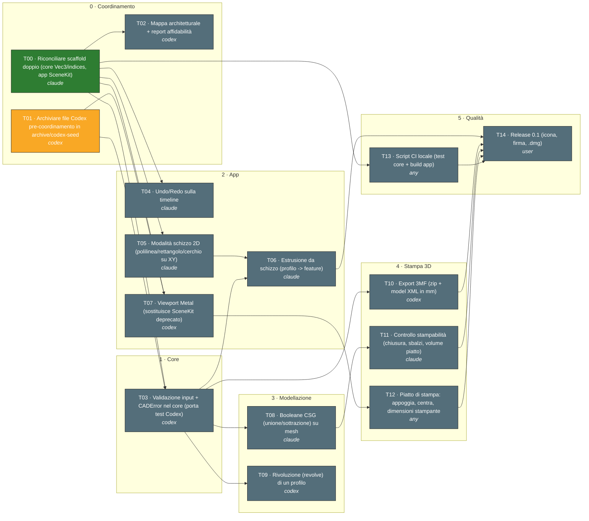

# Grafo dei task

_Generato da `scripts/graph.py` — 2026-09-25 09:31. Non modificare a mano._

Legenda: verde = done · giallo = in corso · rosso = bloccato · grigio = da fare. Etichetta: `ID · titolo · agente`.

## Pronti da iniziare

- **T02** Mappa architetturale + report affidabilità — suggerito: codex
- **T04** Undo/Redo sulla timeline — suggerito: claude
- **T05** Modalità schizzo 2D (polilinea/rettangolo/cerchio su XY) — suggerito: claude
- **T13** Script CI locale (test core + build app) — suggerito: any

## Tabella

| ID | Titolo | Stato | Agente | Dipende da | File |
|---|---|---|---|---|---|
| T00 | Riconciliare scaffold doppio (core Vec3/indices, app SceneKit) | done | claude | — | Packages/CADCore App/Sources project.yml |
| T01 | Archiviare file Codex pre-coordinamento in archive/codex-seed | in_progress | codex | — | archive/codex-seed App/TakeoffCADApp.swift App/CADDocument.swift App/EditorView.swift App/SketchView.swift App/MetalViewport.swift App/CADShaders.metal |
| T02 | Mappa architetturale + report affidabilità | todo | codex | T00 | docs/architecture scripts/architecture_graph.py |
| T03 | Validazione input + CADError nel core (porta test Codex) | todo | codex | T00, T01 | Packages/CADCore/Sources/CADCore/Validation.swift Packages/CADCore/Tests/CADCoreTests/ValidationTests.swift |
| T04 | Undo/Redo sulla timeline | todo | claude | T00 | App/Sources/DesignModel.swift |
| T05 | Modalità schizzo 2D (polilinea/rettangolo/cerchio su XY) | todo | claude | T00 | App/Sources/Sketch |
| T06 | Estrusione da schizzo (profilo -> feature) | todo | claude | T05, T03 | App/Sources/Sketch App/Sources/ContentView.swift |
| T07 | Viewport Metal (sostituisce SceneKit deprecato) | todo | codex | T00, T01 | App/Sources/Viewport |
| T08 | Booleane CSG (unione/sottrazione) su mesh | todo | claude | T03 | Packages/CADCore/Sources/CADCore/CSG.swift Packages/CADCore/Tests/CADCoreTests/CSGTests.swift |
| T09 | Rivoluzione (revolve) di un profilo | todo | codex | T03 | Packages/CADCore/Sources/CADCore/Revolve.swift Packages/CADCore/Tests/CADCoreTests/RevolveTests.swift |
| T10 | Export 3MF (zip + model XML in mm) | todo | codex | T03 | Packages/CADCore/Sources/CADCore/ThreeMF.swift Packages/CADCore/Tests/CADCoreTests/ThreeMFTests.swift |
| T11 | Controllo stampabilità (chiusura, sbalzi, volume piatto) | todo | claude | T08 | Packages/CADCore/Sources/CADCore/Printability.swift |
| T12 | Piatto di stampa: appoggia, centra, dimensioni stampante | todo | any | T07 | App/Sources/Viewport |
| T13 | Script CI locale (test core + build app) | todo | any | T00 | scripts/ci.sh |
| T14 | Release 0.1 (icona, firma, .dmg) | todo | user | T06, T10, T11, T12, T13 | App/Resources project.yml |
