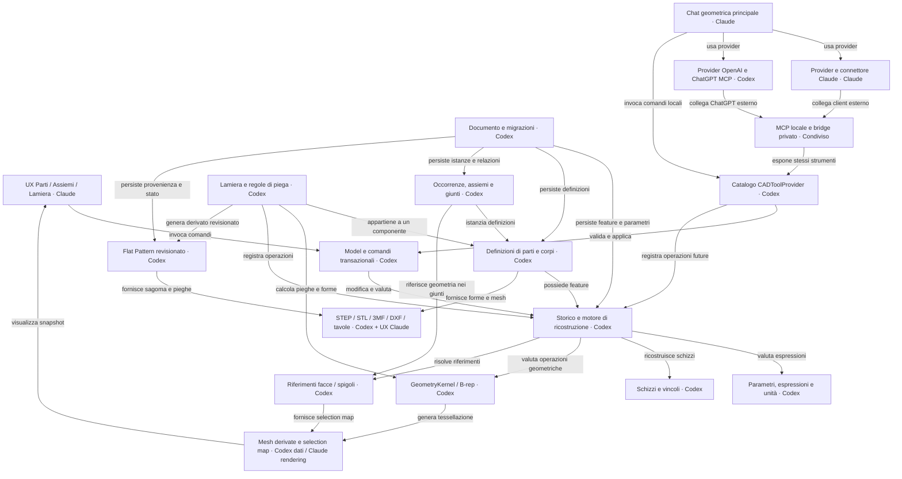

# Grafo del dominio — revisione 3

Fonte canonica: [domain-graph.json](domain-graph.json). Architettura richiesta, non call graph del codice.
Tutti gli archi sono INFERRED: nessuna risoluzione semantica o prova di funzionamento è implicita.
Lo stato operativo è nel [grafo task](../graph/GRAPH.md); accordi nel [registro](../COLLAB.md).

## Lettura del grafo

Chat, Claude e OpenAI condividono il catalogo di comandi e il Model.
Il percorso completo comprende storico, kernel, lamiera, parti e assiemi.
La vista e il JSON derivano dalla stessa descrizione; i riferimenti indicano requisiti, non sorgenti eseguibili.

## Confini di affidabilità

- Grafo dei contratti di progetto: anche dove esiste una v1 non prova la realizzazione completa. Stato implementazione nel grafo task.
- Nessun arco semanticamente risolto; nessuna prova numerica o runtime.
- Stato attività autorevole in docs/graph/tasks.json; non confondere done della specifica con done dell implementazione.
